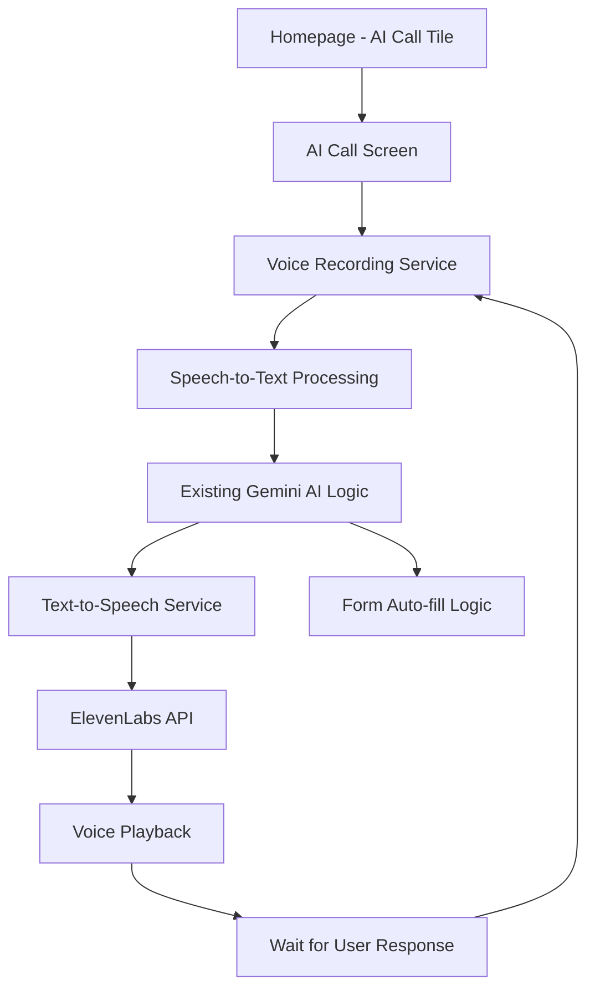

# 🎤 **AI VOICE CALL INTEGRATION - FEASIBILITY & TECHNICAL PLAN**

## ✅ **FEASIBILITY ASSESSMENT: 100% POSSIBLE!**

This is **absolutely feasible** and will create an amazing user experience! Your existing AI chatbot logic can be seamlessly extended to support voice interactions while maintaining all current functionality.

---

# 📋 **COMPREHENSIVE IMPLEMENTATION PLAN**

## **🏗️ ARCHITECTURE OVERVIEW**



## **🔧 TECHNICAL COMPONENTS**

| **Component** | **Technology** | **Purpose** |
|---------------|----------------|-------------|
| **Speech-to-Text** | Web Speech API / Google Cloud STT | Convert user voice to text |
| **Text-to-Speech** | ElevenLabs API | Convert AI responses to voice |
| **Audio Recording** | MediaRecorder API | Capture user microphone input |
| **Audio Playback** | HTML5 Audio API | Play AI voice responses |
| **Real-time Transcription** | WebSocket/Stream processing | Live transcription display |
| **Conversation Management** | Existing Gemini service | Maintain chat state |
| **Form Integration** | Existing job extraction logic | Auto-fill after call |

---

# 📄 **DOCUMENT 1: DEVELOPER IMPLEMENTATION GUIDE**

## **🎯 DEVELOPMENT ROADMAP**

### **Phase 1: Core Voice Services (Days 1-2)**
- [ ] Create `VoiceAICallService` class
- [ ] Implement Speech-to-Text using Web Speech API
- [ ] Create ElevenLabs TTS integration service
- [ ] Add audio recording and playback utilities

### **Phase 2: UI Components (Days 3-4)**
- [ ] Create AI Call tile on homepage
- [ ] Design voice call interface page
- [ ] Add real-time transcription display
- [ ] Implement call controls (start, pause, end)

### **Phase 3: AI Integration (Days 5-6)**
- [ ] Extend existing Gemini service for voice mode
- [ ] Maintain conversation state between text/voice
- [ ] Implement form auto-fill after call completion
- [ ] Add conversation history and playback

### **Phase 4: Testing & Polish (Days 7-8)**
- [ ] Cross-browser compatibility testing
- [ ] Voice quality optimization
- [ ] Error handling and fallbacks
- [ ] Performance optimization

---

## **📁 FILES TO CREATE/MODIFY**

### **New Files:**
```
lib/services/
├── voice_ai_call_service.dart          # Main voice call orchestration
├── eleven_labs_service.dart            # ElevenLabs TTS integration
├── speech_to_text_service.dart         # STT processing
└── audio_recorder_service.dart         # Audio recording utilities

lib/pages/
├── helpee/helpee_ai_voice_call_page.dart
└── helper/helper_ai_voice_call_page.dart

lib/widgets/
├── voice_call/
│   ├── voice_call_interface.dart       # Call UI components
│   ├── audio_visualizer.dart           # Voice activity indicator
│   ├── transcription_display.dart      # Real-time text display
│   └── call_controls.dart              # Start/pause/end buttons
```

### **Modified Files:**
```
lib/services/gemini_ai_chat_service.dart    # Add voice mode support
lib/pages/helpee/helpee_2_home_page.dart    # Add AI Call tile
lib/pages/helper/helper_2_home_page.dart    # Add AI Call tile
lib/services/navigation_service.dart        # Add voice call routes
```

---

## **🔌 API INTEGRATIONS**

### **ElevenLabs Integration:**
```dart
class ElevenLabsService {
  static const String baseUrl = 'https://api.elevenlabs.io/v1';
  
  Future<Uint8List> synthesizeSpeech({
    required String text,
    required String voiceId,
    required String apiKey,
  }) async {
    // Implementation details in main document
  }
}
```

### **Web Speech API Integration:**
```dart
class SpeechToTextService {
  late SpeechRecognition _recognition;
  
  Stream<String> startListening({String language = 'en-US'}) {
    // Real-time transcription stream
  }
}
```

---

## **🎵 VOICE FLOW LOGIC**

```dart
// Conversation Flow
1. User clicks "AI Call" → Navigate to call screen
2. User clicks "Start Call" → Begin voice recording
3. STT converts speech → Send to Gemini AI
4. AI processes → Generate text response
5. TTS converts to speech → Play to user
6. Wait for user response → Repeat cycle
7. Call ends → Auto-fill form with extracted data
```

---

# 📄 **DOCUMENT 2: ELEVENLABS SETUP GUIDE (FOR USER)**

## **🚀 QUICK SETUP CHECKLIST**

### **Step 1: Create ElevenLabs Account**
1. Go to [ElevenLabs.io](https://elevenlabs.io)
2. Sign up for an account
3. Choose a plan (Free tier available for testing)

### **Step 2: Get API Key**
1. Go to your Profile Settings
2. Navigate to "API Keys" section
3. Click "Generate New Key"
4. **Copy and save this key securely**

### **Step 3: Choose/Create Voice**
1. Go to "Voice Lab" section
2. Choose from pre-made voices OR
3. Clone your own voice (recommended)
4. **Copy the Voice ID** (11-character string)

### **Step 4: Test Voice (Optional)**
1. Use the web interface to test your chosen voice
2. Adjust voice settings (stability, clarity, style)
3. Note your preferred settings

---

## **📋 INFORMATION TO PROVIDE TO DEVELOPER**

Please provide these details for integration:

```yaml
# ElevenLabs Configuration
api_key: "your_api_key_here"
voice_id: "your_chosen_voice_id"
voice_settings:
  stability: 0.5        # 0.0 - 1.0
  clarity_boost: true   # true/false
  style: 0.0           # 0.0 - 1.0
  use_speaker_boost: true
```

### **Recommended Voice Settings:**
- **For Professional Helper Bot**: Rachel (premade voice)
- **For Friendly Assistant**: Josh (premade voice)
- **For Custom Experience**: Clone your own voice

---

## **💰 COST CONSIDERATIONS**

| **Usage** | **Characters** | **Cost (Approx)** |
|-----------|----------------|-------------------|
| **Testing** | 10,000 chars | Free tier |
| **Light Usage** | 30,000 chars/month | $1-5/month |
| **Heavy Usage** | 100,000+ chars/month | $22+/month |

**Note**: Average conversation uses ~500-1000 characters per AI response.

---

# 📄 **DOCUMENT 3: TECHNICAL IMPLEMENTATION DETAILS**

## **🎤 VOICE PROCESSING ARCHITECTURE**

### **Real-time Audio Pipeline:**
```
Microphone Input → MediaRecorder → 
Speech Recognition → Text Processing → 
Gemini AI → Response Generation → 
ElevenLabs TTS → Audio Playback
```

### **Error Handling & Fallbacks:**
- Network connectivity issues
- Microphone permission denied
- Speech recognition failures
- TTS API rate limits
- Browser compatibility issues

---

## **🔄 STATE MANAGEMENT**

```dart
class VoiceCallState {
  ConversationState conversationState;
  AudioRecordingState recordingState;
  PlaybackState playbackState;
  TranscriptionState transcriptionState;
  JobExtractionState extractionState;
}
```

---

## **📱 UI/UX DESIGN SPECIFICATIONS**

### **Homepage AI Call Tile:**
- Green gradient background matching app theme
- Microphone icon with audio waves animation
- "AI Voice Assistant" title
- "Talk to get help" subtitle

### **Voice Call Interface:**
- Large central call button (Start/Stop)
- Real-time transcription box
- Audio level visualizer
- Conversation history panel
- Call duration timer
- End call and form fill button

### **Visual Indicators:**
- 🔴 Red: Recording user speech
- 🔵 Blue: Processing AI response
- 🟢 Green: Playing AI voice
- ⏸️ Gray: Waiting/Idle state

---

## **🔐 SECURITY & PRIVACY**

### **Data Handling:**
- Audio data processed locally when possible
- Secure API key management
- User consent for microphone access
- Optional conversation recording/deletion

### **Privacy Compliance:**
- Clear microphone permission requests
- Audio data retention policies
- User control over voice data
- GDPR/privacy law compliance

---

## **📊 PERFORMANCE OPTIMIZATIONS**

- **Audio Compression**: Reduce bandwidth usage
- **Chunked Processing**: Real-time STT streaming
- **Response Caching**: Cache common TTS responses
- **Progressive Enhancement**: Fallback to text if voice fails
- **Lazy Loading**: Load voice components only when needed

---

## **🧪 TESTING STRATEGY**

### **Cross-Browser Testing:**
- Chrome (primary support)
- Firefox (secondary)
- Safari (mobile focus)
- Edge (enterprise users)

### **Device Testing:**
- Desktop microphones
- Mobile device microphones
- Headset/Bluetooth audio
- Various network conditions

---

## **🚀 DEPLOYMENT PLAN**

### **Beta Release:**
1. Limited user testing
2. Voice quality feedback
3. Performance metrics collection
4. Bug fixes and optimizations

### **Production Release:**
1. Full feature rollout
2. Usage analytics implementation
3. Cost monitoring setup
4. User feedback collection system

---

# ✅ **FINAL CONFIRMATION**

## **This integration will provide:**

✅ **Seamless Voice Experience**: Natural conversation with AI  
✅ **Same Intelligence**: Existing Gemini AI logic preserved  
✅ **Real-time Transcription**: See conversation as it happens  
✅ **High-Quality Voice**: Professional ElevenLabs TTS  
✅ **Form Auto-fill**: Same job extraction functionality  
✅ **Cross-Platform**: Works on web and mobile browsers  
✅ **Professional UI**: Matches existing app design  
✅ **Error Handling**: Graceful fallbacks to text mode  

---

**🎯 Ready to proceed?** Once you provide the ElevenLabs API key and voice settings, I can begin implementation immediately following this comprehensive plan!